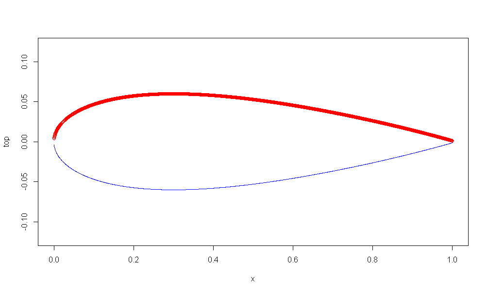
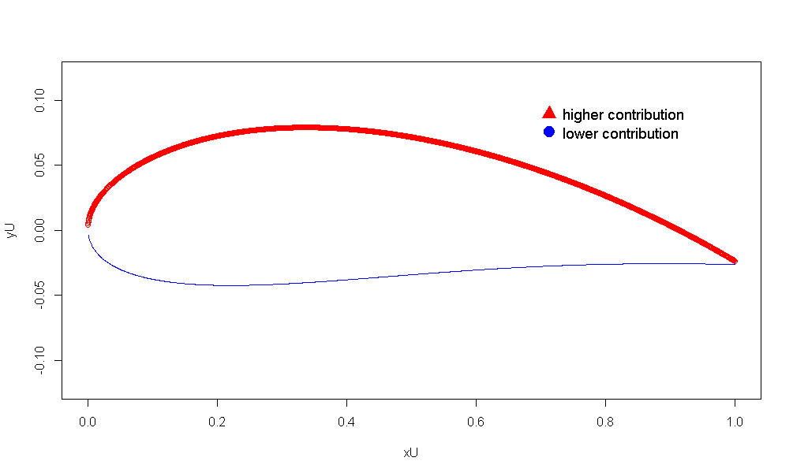

# NACA_Airfoil_plotter
A quick view on how to plot NACA airfoil. Best usage on rainy sunday morning

This is a quick tutorial on how to plot NACA Airfoil profiles, to use in your favorite mesh program.
"NACA" is a norm which makes the render of airfoils easier; indeed information on the wing itself remains in its model name, we will see that later.  
Note: all commentary codes are in french

##Sources

https://fr.wikipedia.org/wiki/Profil_NACA
http://www.aerospaceweb.org/question/airfoils/q0041.shtml

## 4-Digits series
### Simple model - No camber, symmetric

The simplest way to draw an airfoil is to go on wikipedia (link provided in sources) and pick the very first equation:

What to do with all these parameters ?  
Well it is simple:  
First, generate a sample vector, x, and choose and a maximal width of spread, or maximal length of the cord, c. Eventually, choose the maximal height of the curve, this is t. We have our 3 parameters:  
- c, the maximal length of cord  
- x, the sample vector dependent of the number of points  
- t, the maximal height of cord, or maximal thickness

```
nbpoints = 2000
c = 1 # la longueur max de la corde
x = (1:nbpoints )*(c/nbpoints) #les abscisses des noeuds
t = 00.12 # épaisseur max de l'aile
```

Now we can use the lovely R language to plot the whole thing.  
Why R ? Because it is convenient, easy to play with: the parameters of function are pliants.  
One important thing to notice is that, x being a vector, the function takes it as a parameters and executes it on each of its parameters to fill "top" and "bottom".  

```
NACA_sym = function(c,x,t){
  y = (t/0.2)*( 0.2969*sqrt(x/c) - 0.1260*x/c - 0.3516*(x/c)**2 + 00.2843*(x/c)**3 - 0.1015*(x/c)**4 )
  return (y)
}
```

Another thing to notice is that the previous equation renders the top profile of a symmetric airfoil. Because of that we need to fill and draw both "top" and "bottom" vectors.

```
top = NACA_sym(c,x,t)
bottom = -NACA_sym(c,x,t)
plot(x,top,col='red',ylim=range(c( -t , t    )))
lines(x,bottom,col='blue',ylim=range(c( -t , t    )))
```

Here is the example of the NACA0012 airfoil, where 00 stands for symmetric (more details on next section) and 12 is the percentage value of the t parameters.




### Classic model - camber, asymmetric

In this example, same spirit, more complexity because we add 2 more parameters:  -
- m, the maximum camber  
- p, position of m along c (wow such abstraction)  
- c, x, t as before  
I highly suggest that you play with those parameters to really feel what they are related to.  

```
m = 2 /100 #cambrure max - premier chiffre
p = 4 / 10 # position de la cambrure max - deuxième chiffre
nbpoints = 2000
c = 1 # la longueur max de la corde
x = (1:nbpoints )*(c/nbpoints) #les abscisses des noeuds
t = 00.12
```

I won't go into details for the plot function, the source link will explain it better than I would do and the most important thing is first of all to play with the function.  
Note that the plot part is included in the function.  

```
NACA_asym = function(c,x,m,p,t){
  PC = p*c
  y = 0

  if ((x>=0)&&(x<p)){
    yc = m/(p*p)*(2*p*x - x*x)
    theta = atan(   m/(p*p)*(2*p - 2*x)   )
  }
  if ((x>=p)&&(x<=c)){
    yc = m/( (1-p)**2 )*( 1-2*p + 2*p*x - x*x)
    theta = atan(   m/( (1-p)**2 )*( 2*p - 2*x)   )
  }
  yt = (t/0.2)*( 0.2969*sqrt(x) -0.1260*x -0.3516*x*x +0.2843*x*x*x -0.1015*x*x*x*x )
  xU = x-yt*sin(theta)
  yU = yc+yt*cos(theta)
  xL = x+yt*sin(theta)
  yL = yc-yt*cos(theta)
  
  p = plot(xU,yU, col='red',ylim=range(c( -t , t    )))
  lines(xL,yL, col='blue',ylim=range(c( -t , t    )))
  legend("topright",
         legend = c("higher contribution","lower contribution"),
         col = c('red', 'blue'), 
         pch = c(17,19), 
         bty = "n", 
         pt.cex = 2, 
         cex = 1.2, 
         text.col = "black", 
         horiz = F , 
         inset = c(0.1, 0.1)
  )
  return
}
```

Now just fire up the function:

```
NACA_asym(c,x,m,p,t)
```

This example draw the NACA2412 airfoil with some plot options:




## Incoming

5 digits Airfoils...


